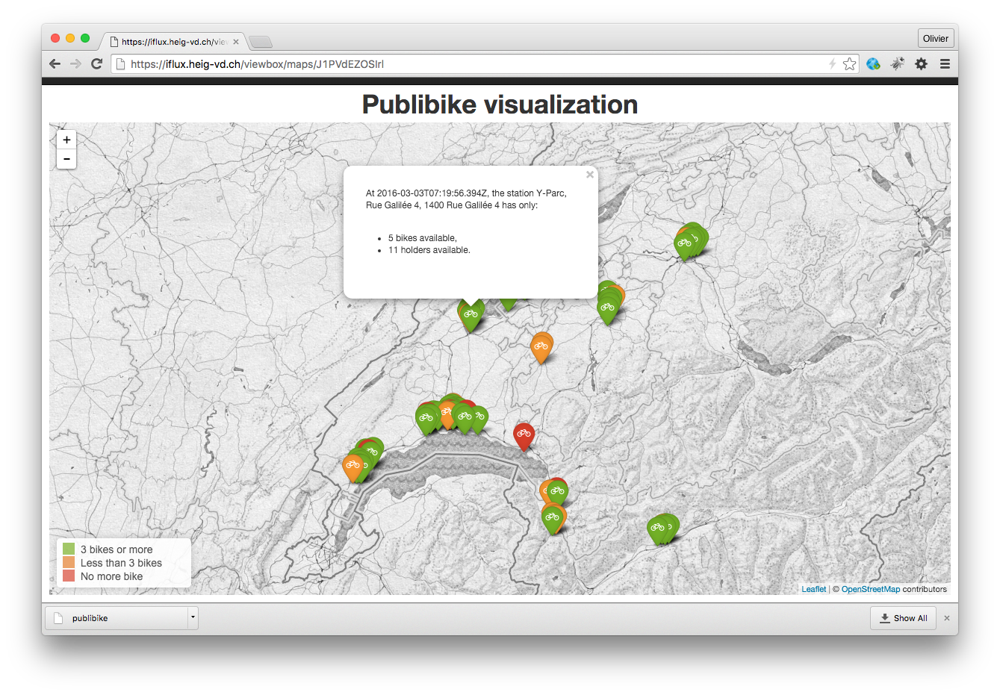
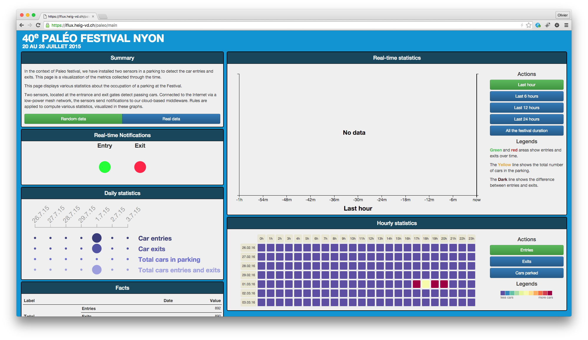

# iflux-cebit-demo

Instructions for the demo @ CeBIT 2016

In case of error/issues/questions, please contact olivier.liechti at heig-vd.ch, with cc: to laurent.prevost at heig-vd.ch. If you don't see anything on the map, please contact us so that we can check the status of the backend.

## Background information

1. Visit the iFLUX web site at: [http://iflux.io](http://iflux.io).
2. Read the blog articles, which will give you the background information (model, architecture and APIs): [http://www.iflux.io/blog.html](http://www.iflux.io/blog.html)
3. Have a look at the API documentation: [http://www.iflux.io/api/](http://www.iflux.io/api/). Note that more comprehensive API documentation is available here ([https://iflux.heig-vd.ch/doc/](https://iflux.heig-vd.ch/doc/)), but it is more difficult to explain, so for this audience I would stick to the basic description.
3. Read this paper, presented at the last Workshop on the Web of Things: [paper](./papers/WoT2015.pdf), [pdf slides](./papers/iFLUX.pdf), [keynote slides](./papers/iFLUX.key).
4. More details are available in this report: [report](./papers/report.pdf).

## Demo 1: Publi Bike

### How to access the demo?

Visit [http://iflux.heig-vd.ch/viewbox/](https://iflux.heig-vd.ch/viewbox/) and click on the Publibike visualization link. You should see this map, which displays the realtime status of the PubliBike network. You can click on the icons to see the detailed status of every station. The color of the icon indicates how many bikes are available (if it's yellow and you are about to leave, you should pay attention!)

### How is it implemented with iFLUX?

* The PubliBike stations are equipped with physical sensors, so the system knows whether a particular slot is free or busy. 

* We have developed an **iFLUX event source**, which emits a stream of events, where every event indicates the ID, name and location of the station, as well as the number of available bikes and slots. This was easy to do with a NodeJS script.

* We have developed an **iFLUX action target**, which manages the information displayed on the map (the action target is the web app that runs the annotated map). In other words, the action target maintains a list of stations with their status. This was easy to do with NodeJS, express.js and leaflet.js.

* Finally, we have setup an **iFLUX rule** that captures the following behavior: **IF** an event of type "publibike.stationUpdate" is received **THEN** send an action to the mapping application so that that it updates the corresponding state. In the rule, we are able to define a transformation schema to transform event properties into action properties.

### What are the key points about the demo?

* One objective was to demonstrate that iFLUX makes it very easy to bring existing systems into the ecosystem, so that Event-Condition-Action rules can be written. Before the demo, the PubliBike system had no knowledge about iFLUX. Same thing for the mapping application. Because we took care to design simple REST APIs and to design an architecture with loose coupling, it was straightforward to transform the existing components into event sources and action targets. The same applies to every project in the iNUIT program. It is easy for each of them to implement the iFLUX APIs, which means that all can be combined at a higher level.

* Displaying a map is only one thing you can do with the system. We have also played with following ideas:

  * We have an action target, which allows us to send a message to the Slack instant messaging application. So, one thing you can do is to create an iFLUX rule where you say: **IF** a PubliBike event arrives **AND** the location of the station is the one near my office **AND** the number of available bikes is less than 2, **THEN** send me a message on Slack that says "Warning: if you don't want to miss your train, you should think about getting a bike!"
  
  * It would be easy to create an action target, which controls a color lamp (with an Arduino controlling LEDs or with a Philipps Hue lightbulb for instance). You could then define an iFLUX rule that changes the color in your office based on the realtime status of the nearest bike station (if you glance at a red lamp on your desk, you will realize that the number of available bikes is critically low).
  
  * These examples show that the event sources and the action targets are decoupled. They do not have to be developed for one specific application, but instead can be combined thanks to the rule system. I can use my Slack action target or my color lamp to notify me about other things that the status of the PubliBike network. Similarly, I could trigger other actions based on what happens in PubliBike: send me a SMS, compute statistics, etc.
  
## Demo 2: Parking status @ Paléo

### How to access the demo?

Visit the UI at [https://iflux.heig-vd.ch/paleo/main](https://iflux.heig-vd.ch/paleo/main). You should see the following dashboard:

* During the festival, we used sensors at the entrance and exit of a parking to emit an event every time a car either entered or left he parking. In other words, we had a physical object acting as an iFLUX event source. This shows that it is possible to implement the iFLUX APIs in firmware and on devices with limited resources.

* The dashboard app is an iFLUX action target, responsible to maintaining state (parking occupancy and statistics).

* We have then configured iFLUX rules, so that whenever a car event is received by the iFLUX middleware, an action is issued to update the state in the dashboard application (back-end).

* The dashboard can work in two modes. During the festival, we used the "real data" mode. At CeBIT, you will have to click on the **"Random data""** button. When you do that, the web app will emit fake iFLUX events and send them to the iFLUX middleware. The rules will be evaluated as usual.

* **IMPORTANT**: the events are emitted as long as the web page is open. So, the recommended setup during the CeBIT exhibition is to open a browser tab as early as possible in the morning and to keep it open. This will ensure a continuous stream of events, with more interesting graphs.

## Demo 3: Integration with the Novaccess infrastructure

* In the Novaccess demo, we show that street lights can be equipped with "smart objects", which makes it possible to communicate with them in both directions. In one direction, we can get measures from sensors (consumption, faults, etc.). In the other direction, we can send commands to the street lights (to change the light level, to turn on/off, etc.).

* We have worked with Novaccess to make the street lights iFLUX compatible. The steet light can be both **event sources** and **action targets**:

  * When they are **event sources**, you can think of many different applications. For instance, you can display a map (like in the Publi Bike demo) that shows street lights and represents their status (level, faults, etc.). You can also think about a rule that says **IF** a fault is reported by a street light sensor **THEN** log an issue in the incident management used by the city service (or send an SMS, etc.).
  
  * When they are **action targets**, you can think of rules that adapt the light level based on special events (for instance, you can adapt the light level based on the realtime traffic condition, on the weather, on public events, etc.)

